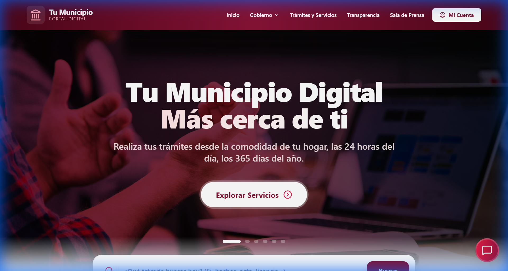
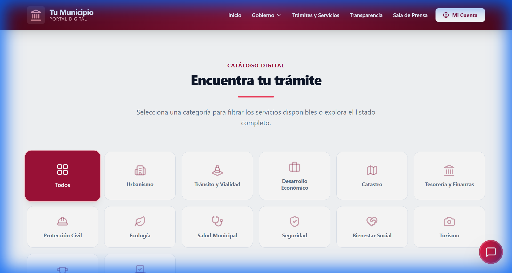

# 🏛️ Portal Ciudadano Municipal

[](LICENSE)
[](https://reactjs.org/)
[](https://www.typescriptlang.org/)
[](https://vitejs.dev/)

> **Plataforma moderna para la digitalización de servicios gubernamentales a nivel municipal**

Una solución completa y lista para implementar que transforma la manera en que los gobiernos municipales entregan servicios a sus ciudadanos. Construida con tecnologías web modernas, esta plataforma centraliza la gestión de trámites, transparencia, noticias y atención ciudadana en un solo lugar accesible y fácil de usar.

---

## 📚 Tabla de Contenidos

- [Vista Previa](#-vista-previa)
- [Demostración Personalizada](#-quieres-ver-una-demostración-personalizada)
- [Acerca del Proyecto](#-acerca-del-proyecto)
- [Características](#-características-principales)
- [Stack Tecnológico](#️-stack-tecnológico)
- [Instalación](#-instalación-y-configuración)
- [Personalización](#-integración-y-personalización)
- [Seguridad](#-consideraciones-de-seguridad)
- [Roadmap](#️-hoja-de-ruta)
- [Autor](#-autor)
- [Contacto](#-contacto-y-colaboración)
- [Licencia](#-licencia)

### 📖 Documentación Completa

- 🏗️ [Arquitectura del Sistema](docs/ARCHITECTURE.md) - Diseño técnico y estructura del código
- 🎨 [Guía de Personalización](docs/CUSTOMIZATION.md) - Cómo adaptar el portal a tu municipio
- 🗺️ [Hoja de Ruta](docs/ROADMAP.md) - Funcionalidades futuras y visión del proyecto
- 🔒 [Consideraciones de Seguridad](SECURITY.md) - Guía para despliegue en producción

---

## 📸 Vista Previa

Consulta la [Guía Visual Completa](docs/SCREENSHOTS.md) con capturas de pantalla de todas las funcionalidades.





---

## 📅 ¿Quieres ver una demostración personalizada?

Si representas a un gobierno municipal interesado en digitalizar sus servicios, estaré encantado de presentar una demo adaptada a tus necesidades específicas.

**📧 Contacto**: [manuelceomx@gmail.com](mailto:manuelceomx@gmail.com) | 💬 [Telegram](https://t.me/manuelceo)

---

## 🎯 Acerca del Proyecto

### ¿Qué es?

El **Portal Ciudadano Municipal** es una plataforma web integral diseñada específicamente para gobiernos municipales que buscan modernizar su infraestructura digital. La aplicación centraliza todos los servicios esenciales que un municipio necesita ofrecer a sus ciudadanos:

- **Catálogo de Servicios**: Sistema completo de gestión y búsqueda de trámites municipales
- **Flujos de Servicio Guiados**: Cada trámite cuenta con un proceso paso a paso intuitivo
- **Portal de Transparencia**: Sección dedicada al cumplimiento de obligaciones de transparencia
- **Gestión de Noticias**: Sistema de publicación de comunicados y noticias oficiales
- **Directorio de Funcionarios**: Organigrama navegable e información de contacto
- **Asistente Virtual Inteligente**: Ayuda ciudadana mediante inteligencia artificial
- **Sistema de Autenticación**: Módulo de login y gestión de cuentas ciudadanas

### ¿Para quién es?

Esta plataforma está diseñada para **gobiernos municipales** que quieren:

✅ Modernizar la atención y servicios ciudadanos  
✅ Cumplir con obligaciones de transparencia de manera eficiente  
✅ Reducir tiempos de gestión y mejorar la experiencia del usuario  
✅ Implementar tecnología moderna sin depender de sistemas legacy costosos  
✅ Tener una presencia digital profesional y accesible 24/7  

### ¿Por qué existe?

Este proyecto demuestra cómo se puede construir infraestructura digital gubernamental de clase mundial utilizando tecnologías web modernas. No es necesario depender de sistemas legacy complejos y costosos: la transformación digital municipal es accesible, escalable y puede implementarse con estándares web actuales.

---

## ✨ Características Principales

### 🗂️ Catálogo de Servicios Interactivo
Sistema completo de categorización, búsqueda y presentación de todos los trámites municipales. Los ciudadanos pueden explorar servicios por categoría o usar el buscador inteligente.

### 🔄 Flujos de Servicio Guiados
Cada trámite municipal cuenta con un flujo paso a paso que guía al ciudadano a través de todo el proceso, mostrando requisitos, documentos necesarios, tiempos estimados y pasos a seguir.

### 🤖 Asistente Virtual con IA
Sistema de recomendaciones inteligente que ayuda a los ciudadanos a encontrar el servicio que necesitan mediante conversación natural.

### 📊 Portal de Transparencia
Módulo completo para cumplir con las obligaciones de transparencia: publicación de documentos presupuestarios, reportes, licitaciones y más.

### 📰 Gestión de Noticias y Comunicados
Sistema de gestión de contenido para publicar noticias oficiales, comunicados de prensa y actualizaciones del municipio.

### 👥 Directorio de Funcionarios
Organigrama interactivo con información de contacto, horarios de atención y áreas de responsabilidad de cada funcionario.

### 🔐 Sistema de Autenticación Ciudadana
Módulo de registro, login y gestión de cuenta personal para que los ciudadanos puedan dar seguimiento a sus trámites (demo incluido).

### 📱 Diseño Responsivo
Funciona perfectamente en dispositivos móviles, tablets y computadoras de escritorio. La experiencia se adapta al tamaño de pantalla automáticamente.

### 🎨 Tematización Configurable
Personaliza colores institucionales, logos y marca del municipio fácilmente mediante archivos de configuración.

---

## 🛠️ Stack Tecnológico

| Categoría | Tecnología | Versión |
|-----------|-----------|---------|
| **Framework Frontend** | React | 19.2 |
| **Lenguaje** | TypeScript | 5.8 |
| **Build Tool** | Vite | 6.2 |
| **Iconografía** | Lucide React | 0.562 |
| **Inteligencia Artificial** | Google Generative AI | 1.35 |
| **Arquitectura** | SPA con routing del lado del cliente | - |
| **Gestión de Estado** | React Hooks (useState, useEffect) | - |

---

## 🚀 Instalación y Configuración

### Prerrequisitos

- **Node.js** (versión 18 o superior recomendada)
- **npm** (incluido con Node.js)

### Pasos de Instalación

1. **Clonar el repositorio**
   ```bash
   git clone https://github.com/tuusuario/portal-ciudadano-municipal.git
   cd portal-ciudadano-municipal
   ```

2. **Instalar dependencias**
   ```bash
   npm install
   ```

3. **Configurar variables de entorno**
   
   Crea un archivo `.env.local` en la raíz del proyecto:
   ```bash
   GEMINI_API_KEY=tu_clave_api_aqui
   ```
   
   > **Nota**: Para obtener una API key, visita [Google AI Studio](https://ai.google.dev/)

4. **Ejecutar en modo desarrollo**
   ```bash
   npm run dev
   ```
   
   La aplicación estará disponible en `http://localhost:3000`

5. **Compilar para producción** (opcional)
   ```bash
   npm run build
   npm run preview
   ```

---

## 🔧 Integración y Personalización

Aunque esta plataforma es funcional de manera inmediata, fue diseñada pensando en la **customización y extensibilidad**.

### Capacidades de Integración

Este portal puede integrarse fácilmente con:

- ✅ **Bases de datos gubernamentales existentes** para flujos de trámites reales
- ✅ **APIs de pasarelas de pago** para cobro de servicios en línea
- ✅ **Sistemas de firma electrónica** (e.firma, CURP digital, etc.)
- ✅ **Plataformas estatales y federales** para interoperabilidad
- ✅ **Sistemas de notificaciones** (email, SMS, WhatsApp)

### Arquitectura Modular

La estructura del código permite:

- Añadir nuevos servicios al catálogo modificando archivos de configuración
- Integrar con backends personalizados (Node.js, PHP, .NET, etc.)
- Personalizar temas, colores y marca institucional sin cambiar código
- Extender funcionalidades mediante componentes React reutilizables

### ¿Necesitas una solución a medida?

Si bien este boilerplate cubre las funcionalidades esenciales, cada municipio tiene necesidades únicas. **Ofrezco servicios de desarrollo personalizado** para adaptar esta plataforma a requerimientos específicos.

Consulta [docs/CUSTOMIZATION.md](docs/CUSTOMIZATION.md) para más detalles sobre opciones de personalización.

---

## 🔒 Consideraciones de Seguridad

⚠️ **Importante**: Este proyecto es un **boilerplate de demostración**.

Para despliegue en entornos de producción gubernamentales se requieren medidas adicionales de seguridad, incluyendo:

- Autenticación robusta y manejo seguro de sesiones
- Encriptación de datos sensibles
- Certificados SSL/TLS
- Auditorías de seguridad y penetration testing
- Cumplimiento con normativas de protección de datos

Revisa [SECURITY.md](SECURITY.md) para una guía completa de consideraciones de seguridad.

---

## 🗺️ Hoja de Ruta

Este proyecto está en constante evolución. Algunas funcionalidades planeadas para futuras versiones:

- 💳 **Pagos en línea** - Integración con pasarelas de pago
- 📅 **Sistema de citas** - Agendamiento de turnos para atención presencial
- 🔔 **Notificaciones push** - Alertas en tiempo real para ciudadanos
- 📊 **Panel administrativo** - Dashboard para gestión de contenido
- 📱 **Aplicación móvil nativa** - Versión para iOS y Android

Consulta el [roadmap completo](docs/ROADMAP.md) para ver la visión a largo plazo del proyecto.

---

## 👨‍💻 Autor

**Desarrollado por Manuel Castellanos Chávez**

Soy un desarrollador especializado en soluciones digitales para el sector público y privado. Este proyecto surge de la creencia de que la tecnología debe ser accesible y transparente, especialmente en instituciones gubernamentales que sirven a la comunidad.

[](https://linkedin.com/in/manuelceomx)
[](mailto:manuelceomx@gmail.com)

---

## 📞 Contacto y Colaboración

### Canales de Comunicación

📧 **Email**: [manuelceomx@gmail.com](mailto:manuelceomx@gmail.com)  
💼 **LinkedIn**: [linkedin.com/in/manuelceomx](https://linkedin.com/in/manuelceomx)  
💬 **Telegram**: [@manuelceo](https://t.me/manuelceo)

### Horarios de Respuesta
- **Email**: 24-48 horas
- **Telegram**: Respuestas más rápidas para consultas urgentes
- **LinkedIn**: Networking profesional

### ¿Cuándo contactarme?

Si representas a un gobierno municipal interesado en digitalizar sus servicios, estaré encantado de:

- 🎥 Presentar una **demostración personalizada** de la plataforma
- 💬 Discutir cómo esta solución puede **adaptarse a tus necesidades específicas**
- 🛠️ Desarrollar **funcionalidades customizadas** para tu municipio
- 📚 Proporcionar **capacitación** para tu equipo técnico

---

## 📄 Licencia

Este proyecto está licenciado bajo la **Licencia Creative Commons BY-NC-SA 4.0** - consulta el archivo [LICENSE](LICENSE) para más detalles.

### ¿Qué significa?

✅ **Uso GRATUITO para**:
- Gobiernos municipales, estatales y federales
- Instituciones educativas y de investigación  
- ONGs y organizaciones sin fines de lucro

⚠️ **Uso comercial REQUIERE licencia**:
- Empresas privadas que ofrezcan el portal como servicio
- Consultorías que implementen para clientes
- Proveedores SaaS de soluciones municipales

**Para licencia comercial**: [manuelceomx@gmail.com](mailto:manuelceomx@gmail.com)

**Licencia completa**: [CC BY-NC-SA 4.0](https://creativecommons.org/licenses/by-nc-sa/4.0/deed.es)

---

## 🙏 Agradecimientos

Gracias a la comunidad de código abierto y a los siguientes proyectos que hacen posible esta plataforma:

- [React](https://reactjs.org/) - La biblioteca UI que impulsa la interfaz
- [Vite](https://vitejs.dev/) - Build tool ultrarrápido
- [TypeScript](https://www.typescriptlang.org/) - Type safety y mejor experiencia de desarrollo
- [Lucide React](https://lucide.dev/) - Iconografía moderna y elegante

---

## ⭐ ¿Te resultó útil?

Si este proyecto te pareció valioso:

- ⭐ **Dale una estrella** en GitHub para ayudar a otros a descubrirlo
- 🔄 **Comparte** con colegas en el sector público que puedan beneficiarse
- 💡 **Contribuye** con ideas, sugerencias o pull requests

**Pull requests y sugerencias son siempre bienvenidas.**

---

<div align="center">

**Construyendo el futuro del gobierno digital, un municipio a la vez** 🏛️✨

---

## 🔗 Enlaces Rápidos

| Documentación | Descripción |
|---------------|-------------|
| [Arquitectura](docs/ARCHITECTURE.md) | Diseño técnico del sistema |
| [Personalización](docs/CUSTOMIZATION.md) | Guía de customización |
| [Roadmap](docs/ROADMAP.md) | Funcionalidades futuras |
| [Seguridad](SECURITY.md) | Consideraciones de producción |
| [Licencia](LICENSE) | Términos de uso |

</div>
